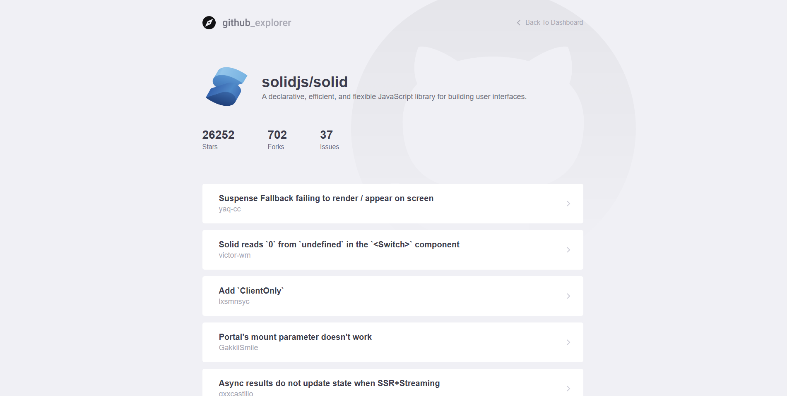

<h1 align="center">
    GitHubExplorer SolidJS
</h1>

I took a project that I developed on the rocketseat bootcamp that was originally developed using react, and try to make it using SolidJS to study.The purpose of the project is to search repositories from Github and see their opened issues. It was developed using SolidJS and the GitHub Api 💜💜💜

## 💻 Project

## 🚀 Technologies

This project was developed with the following technologies:

- [x] Typescript

- [x] SolidJS

- [x] Solid Styled Components

- [x] Vite

## Usage

    pnpm install.
    pnpm run dev.

## Participants

| [Samuel Formigheri](https://github.com/SamuelFormigheri)